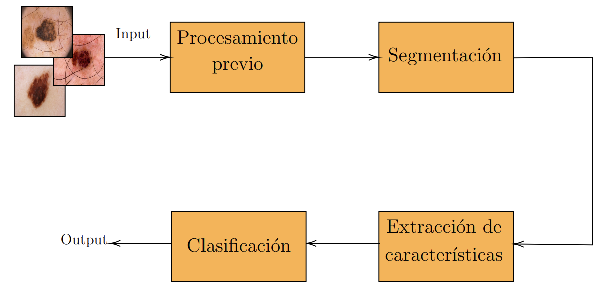

# Lesiones de piel - Detección de Melanoma

[Página web del proyecto](https://mauricio.olivera.da.pages.fing.edu.uy/lesiones-de-piel/).

Este es el repositorio del proyecto de Detección de Melanoma.
Este proyecto combina técnicas de procesamiento de imágenes y aprendizaje automático, para detectar la presencia de melanomas en una lesión de piel.  

En la siguiente figura se presenta un ejemplo de lesión de piel. Dicha lesión es melanoma.

Para este proyecto, se utilizo una subbase de imagenes, basada en los datos proporcionados en la competencia [ISIC de 2017](https://challenge.isic-archive.com/data/#2017). Ademas, se uso una base pequeña basada en la la competencia [ISIC de 2018](https://challenge.isic-archive.com/data/#2018), la cual contiene imágenes seleccionadas manualmente.

En el repositorio se encunetran los notebooks relacionados con cada etapa del modelo, las cuales se pueden ver en la siguiente imagen.

<figure>
  
  <figcaption>
  Ejemplo de imagen de lesión de piel.
  </figcaption>
</figure>

Equipo:
- Pedro Pertusso - pedropertusso@gmail.com
- Mauricio Olivera - oliveramauricio1229@gmail.com
